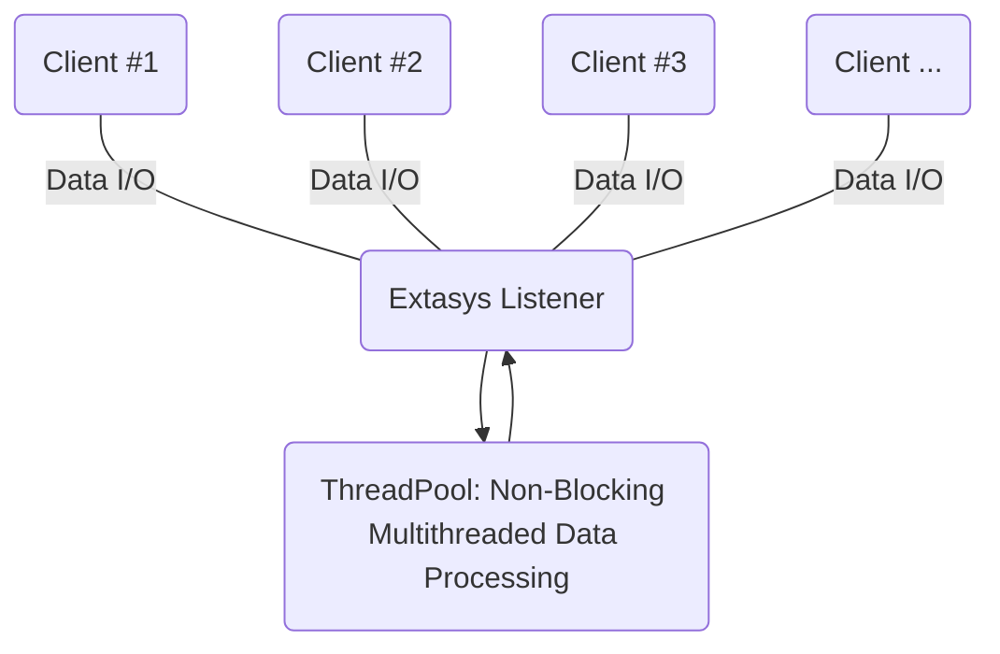

Extasys - Asynchronous TCP/UDP socket library
=======

Extasys is a high performance, **asynchronous TCP/UDP socket library** originally made with Java. Its **multi-threaded and lightweight** nature makes it ideal for super fast data transfer even on systems with ARM architecture like smartphones and single-board computers (Raspberry Pi, Orange Pi etc.).

If you are using sockets then Extasys is the proper tool for your work. It's been designed to take the hard job done and let you think only about the message exchange (the process).

#### Features
* Dedicated Thread Pool for each TCPServer, TCPClient, UDPServer and UDPClient
* Multiple listeners per server and multiple connectors per Client
* TCP message collector with character or string message splitter
* On the fly Data Encryption

Extasys project is Developed with <a href="https://netbeans.apache.org/"><b>NetBeans IDE</b><a>

## How to Use

Fully functional examples on how to use Extasys can be found [inside the repository](https://github.com/nsiatras/extasys/tree/master/Extasys%20for%20Java%20Examples). More information on how to use Extasys can be found on the [wiki pages](https://github.com/nsiatras/extasys/wiki)
 
 #### Easy to follow examples:
 * [TCP Server Example](https://github.com/nsiatras/extasys/tree/master/Extasys%20for%20Java%20Examples/Extasys.Examples.TCPServer) - Simple TCP Server with UI
 * [TCP Client Example ](https://github.com/nsiatras/extasys/tree/master/Extasys%20for%20Java%20Examples/Extasys.Examples.TCPClient) - Simple TCP Client with UI
 * [UDP Server Example ](https://github.com/nsiatras/extasys/tree/master/Extasys%20for%20Java%20Examples/Extasys.Examples.UDPServer) - Simple UDP Server with UI
 * [UDP Client Example ](https://github.com/nsiatras/extasys/tree/master/Extasys%20for%20Java%20Examples/Extasys.Examples.UDPClient) - Simple UDP Client with UI
 
 #### Chat Server client examples:
 * [TCP Chat Server Example](https://github.com/nsiatras/extasys/tree/master/Extasys%20for%20Java%20Examples/Extasys.Examples.TCPChatServer) - Chat Server Example with UI
* [TCP Chat Client Example](https://github.com/nsiatras/extasys/tree/master/Extasys%20for%20Java%20Examples/Extasys.Examples.TCPChatClient) - Chat Client Example with UI

#### Quick Examples:
* [Establish a TCP Server](https://github.com/nsiatras/extasys/wiki/Establish-a-TCP-Server)
* [Establish a TCP Client](https://github.com/nsiatras/extasys/wiki/Establish-a-TCP-Client)
* [Establish a UDP Server](https://github.com/nsiatras/extasys/wiki/Establish-a-UDP-Server)
* [Establish a UDP Client](https://github.com/nsiatras/extasys/wiki/Establish-a-UDP-Client)
